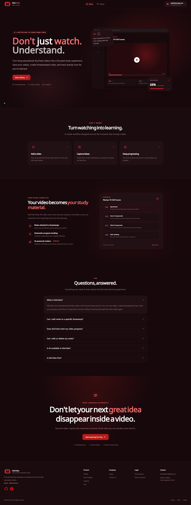
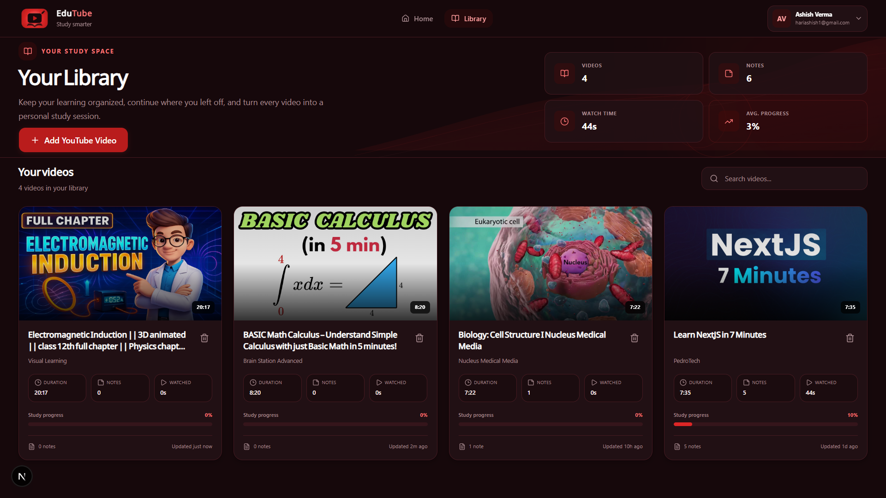
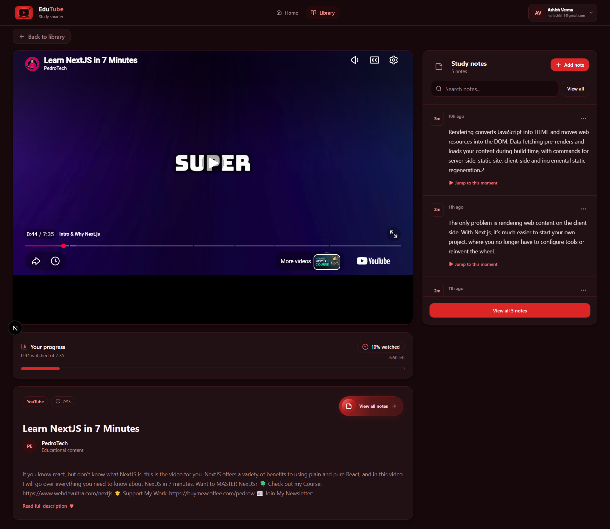

# EduTube

EduTube is an educational video learning platform built with Next.js, React, TypeScript, Prisma, PostgreSQL/Supabase, YouTube API, Gemini AI, and Cypress.

## 🚀 Getting Started

### 1. Install dependencies

```bash
npm install
```

### 2. Configure environment variables

Create a `.env` file in the project root:

```env
DATABASE_URL="your_supabase_database_url"
DIRECT_URL="your_supabase_direct_url"
YOUTUBE_API_KEY="your_youtube_api_key"
GEMINI_API_KEY="your_gemini_api_key"
AUTH_SECRET="your-long-random-secret"
```

### 3. Setup Prisma

```bash
npx prisma generate
npx prisma migrate dev
```

### 4. Start the project

```bash
npm run dev
```

Open:

```text
http://localhost:3000
```

## 🔐 Dummy Login

Use these credentials for testing:

- **Email:** `hariashish1@gmail.com`
- **Password:** `admin123`

Live Link - 
```text
https://edu-tube-flax.vercel.app/
```

## 📸 Project Screenshots

### Home


### Library


### Video Study


